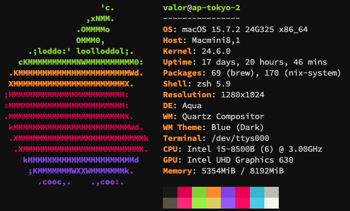

自从上次的记录 idc 的 p1 之后，我又有想要开始售卖 vps 和 vds 等服务的想法。为了实现这个想法和我的一个小愿望，我通过朋友的介绍注册了
ASN 并成功的广播了自己的 IPv6 地址。

## 服务器

还是从服务器先谈起，自从暑假的时候在上海部署了三台服务并开放给我朋友使用。~~（我朋友有概率可以白嫖我的服务器）~~
我得到的反馈和自己的使用体验告诉我，上海的家里的网络环境并不适合我部署服务器和提供部署服务。因此我决定了，我要迁移我的
`AP-SHANGHAI-1` 到东京成为第三台机器。

通过“简陋”获得了一台 MacOS 作为我的备用和测试用的电脑。并且准备使用我人生中第一台组装机的“后代”， 5600x 系列作为测试用的服务器。

关于我的服务器可以前往 [https://status.jianyuelab.org](https://status.jianyuelab.org) 查看。

## 网络

既然要开始售卖服务器，那么肯定要有自己的 IP 地址对吧。找 ISP 租用地址有一定的法律风险，有概率被查水表。那么竟然如此为什么不完成一个自己的小愿望，拥有自己的
ASN 呢对吧...

那就花了一点小小的超能力和等待了三天左右的时间，我获得到了 [AS215172](https://bgp.tools/as/215172)。（我开放 Peer
但是技术不到家哈～）并且获得到了我的 /40 的 IPv6 地址，并广播了第一段到我东京的服务器上。（真后悔最早没有开始使用
IPv6，不然就不会花费那么多的时间去学习和弄 IPv6 的相关配置了）

还是要感谢 RouterOS 的便捷性，让我减少了许多的麻烦，比 OPNSENSE 和 OpenWRT 好用多了。

## 推销和预告

那我们的 VictorCloud 就要复活了，快了吧... 具体详细可以前往[ VC 的官网](https://victorcloud.io)或者是通过官网里的 TG
社区加入我们。 还在学习并开发自己的服务体系，自从 CloudFlare 等大厂出现过问题之后，还是意识到数据掌握在自己手里的重要性。毕竟死了，自己能救。
