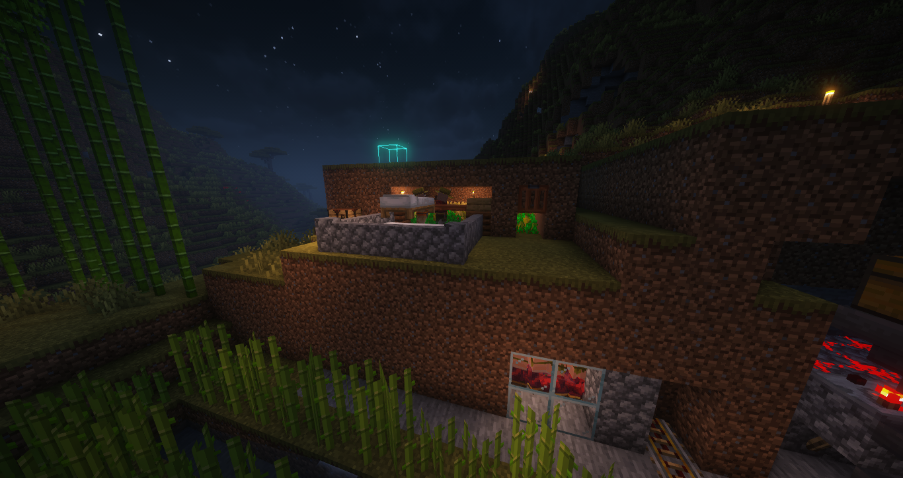
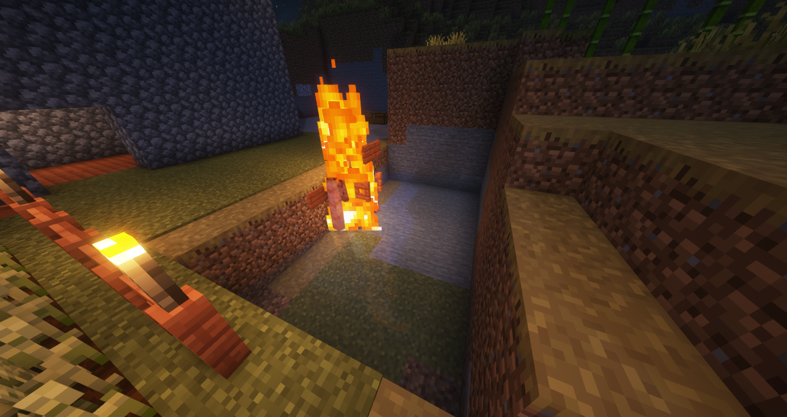
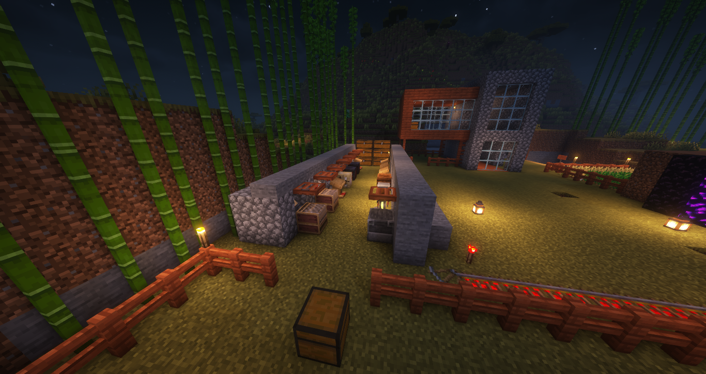
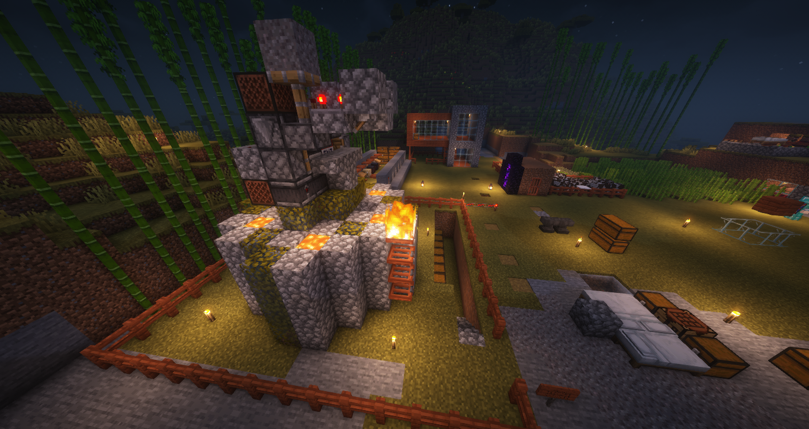

> 服务器的活跃玩家在基地和合照——从左往右 Hashtag233、xiaowenYOyo、JianyueHugo、wo_shigeshabi

某一天，和朋友联机Minecraft的时候，我们几个人想玩。但是如果开存档的人不在或者没空，不就完不成了。所以说，我开了一个Minecraft的服务器！

我们在出生点边上的村庄，开始了发育。然后我们开始建设机器以便减轻我们的人工负担。

> 村民繁殖机 2nd, Made by xiaowenYOyo

> 刷铁机, Made by Hashtag233

> 村民交易所, Made by JianyueHugo

> 刷石机, Made by Hashtag233

开服才几天就能有这个进展是让我意想不到的，还是希望服务器能坚持开下去和有更多的小伙伴来玩！
